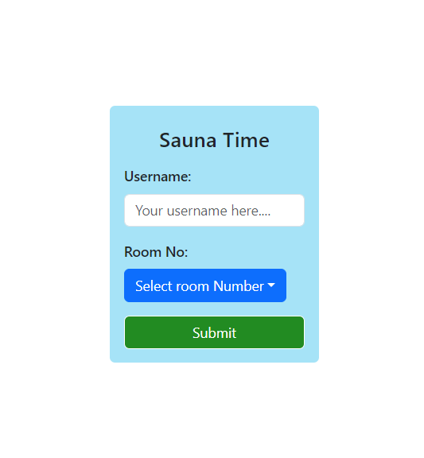
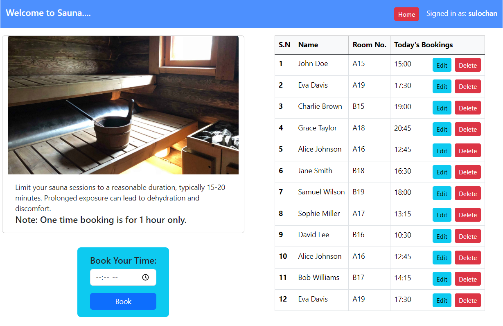

 <h1>Sauna Booking Web Application</h1>
   

    
    

  

<h2 id="project-description">Project Description</h2>
    

        The <strong>Sauna Booking Web Application</strong> is a full-stack web application designed for booking sauna sessions.
        The application features a ReactJS frontend styled with Bootstrap, and a NodeJS server backend with MongoDB for data storage.
        Users can log in, book sauna sessions, view their bookings, and edit or delete them as needed.
    

    <h2 id="installation">Installation</h2>
    
To run this project locally, follow these steps:

    <h3>Prerequisites</h3>
    <ul>
        <li>Node.js (v12 or higher)</li>
        <li>npm (v6 or higher)</li>
        <li>MongoDB</li>
    </ul>
    <h3>Clone the Repository</h3>
    <pre><code>git clone https://github.com/your-username/sauna-booking-web-application.git
cd sauna-booking-web-application
</code></pre>
    <h3>Install Dependencies</h3>
    <h4>Frontend</h4>
    <pre><code>cd frontend
npm install
</code></pre>
    <h4>Backend</h4>
    <pre><code>cd ../server
npm install
</code></pre>
    <h3>Run the Application</h3>
    
Start the MongoDB server if not already running, then start the frontend and backend servers.

    <h4>Backend</h4>
    <pre><code>cd server
npm start
</code></pre>
    
The backend server will run on <code>http://localhost:5000</code>.

    <h4>Frontend</h4>
    
In a new terminal window, start the frontend server:

    <pre><code>cd frontend
npm start
</code></pre>
    
The frontend server will run on <code>http://localhost:3000</code>.

    <h2 id="usage">Usage</h2>
    <h3>Login</h3>
    
Users must log in to access the booking features. The login page is accessible at the root URL of the frontend.

    <h3>Booking Sauna</h3>
    
Once logged in, users can book a sauna session from the home screen. The available slots are shown, and users can select their preferred time.

    <h3>Manage Bookings</h3>
    
Users can view their bookings on the home screen, with options to edit or delete any booking.

    <h2 id="features">Features</h2>
    <ul>
        <li><strong>Login</strong>: login system.</li>
        <li><strong>Booking Management</strong>: Book, view, edit, and delete sauna sessions.</li>
        <li><strong>Responsive Design</strong>: The application is responsive and works well on various devices.</li>
        <li><strong>Data Storage</strong>: All data is stored in a MongoDB database.</li>
    </ul>
    <h2 id="contributing">Contributing</h2>
    
Contributions are welcome! Please follow these steps:

    <ol>
        <li>Fork the repository.</li>
        <li>Create a new branch (<code>git checkout -b feature/your-feature-name</code>).</li>
        <li>Make your changes and commit them (<code>git commit -m 'Add some feature'</code>).</li>
        <li>Push to the branch (<code>git push origin feature/your-feature-name</code>).</li>
        <li>Create a Pull Request.</li>
    </ol>
    
Please ensure your code adheres to the project's coding style and standards.

    <h2 id="license">License</h2>
    
This project is licensed under the MIT License - see the <a href="LICENSE">LICENSE</a> file for details.

    <h2 id="contact">Contact</h2>
    
For any questions or feedback, please reach out to us at <a href="mailto:sulochanbarakoti09@gmail.com">sulochanbarakoti09@gmail.com</a>.

</body>
</html>
